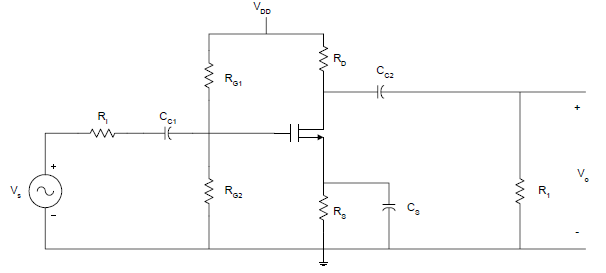
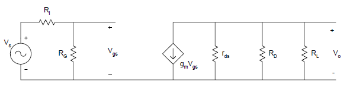

## Theory

#### Field-effect transistor (FET)

A field-effect transistor (FET) is a type of transistor commonly used for weak-signal amplification (for example, for amplifying wireless (signals). The device can amplify analog or digital signals. It can also switch DC or function as an oscillator. A FET is a three terminal semiconductor device in which current conduction is by one type of carries & is controlled by the effect of electric field. In the FET, current flows along a semiconductor path called the channel. At one end of the channel, there is an electrode called the source. At the other end of the channel, there is an electrode called the drain. The physical diameter of the channel is fixed, but its effective electrical diameter can be varied by the application of a voltage to a control electrode called the gate.

There are two types of FET namely the junction FET (JFET) and the metal-oxide- semiconductor FET (MOSFET).The junction FET has a channel consisting of N-type semiconductor (Nchannel) or P-type semiconductor (P-channel) material; the gate is made of the opposite semiconductor type. In P-type material, electric charges are carried mainly in the form of electron deficiencies called holes. In N-type material, the charge carriers are primarily electrons. A N-channel JFET has a N-type semiconductor bar, the two ends of which make the Drain & source terminal. On the two sides of this bar, P-N junction is made. This P region makes gate. Usually, these two gates are connected together to form a single gate. The gate is given a –ve bias w.r.t source. The Drain is given +ve potential w.r.t source.

#### Common Source Amplifier

The Common Source Amplifier is one of the three basic FET transistor amplifier configurations. In comparison to the BJT common-emitter amplifier, the FET amplifier has much higher input impedance, but a lower voltage gain. The Junction Field Effect Transistor (JFET) offers very high input impedance along with very low noise figures. It is very suitable for extremely low-level audio applications as in audio preamplifiers. The JFET is more expensive than conventional bipolar transistors but offers superior overall performance. Unlike bipolar transistors, current can flow through the drain and source in any direction equally. Often the drain and source can be reversed in a circuit with almost no effect on circuit operation.

The bias levels in amplifiers based on BJTs are often stabilized using the emitter degeneration technique; that is, a resistor is placed between the transistor‟s emitter and ground. The resistor creates negative feedback, which forces the quiescent collector current to remain at its design value regardless of changes in the transistor‟s parameters (such as βF). A similar technique can be used to stabilize the biasing of FET amplifiers.

#### Frequency response of Common Source Amplifier

A common-source JFET amplifier in which a resistor RS has been added between the source and ground. In this circuit the gate has been connected to ground through the resistor RG; thus, the gate is held at ground potential (0 V). If the drain current ID begins to rise above its intended quiescent value, the voltage drop across RS will increase. Since the gate-source voltage VGS is the difference between the gate potential (fixed at 0 V) and the voltage across RS, a rise in the voltage across RS will cause VGS to drop, lowering ID back to its original value. The opposite chain of events occurs if ID begins to drop below its design value. It is a common practice in the design of circuits based on JFETs to tie the gate to ground potential via a large-valued resistor (typically around 1MΩ). The circuit for the common source amplifier is shown in figure 1.

Figure 1

The external capacitors CC1 CC2, and CS will influence the low frequency response. The internal capacitances of the FET will affect the high frequency response of the amplifier. The midband gain, Am, is obtained from the midband equivalent circuit of the common-source amplifier. This is shown in Figure 2. The equivalent circuit is obtained by short-circuiting all the external capacitors and opencircuiting all the internal capacitances of the FET.

Figure 12

 Using voltage division
                    $$V_{gs} =\frac{R_G}{R_G + R_I} \times V_s$$
                    From Ohm’s Law,
                    $$V_o=-g_m \times V_{gs} (r_{ds} || R_L || R_D) $$
                       Output is taken at drain and gain is calculated by using the expression,
                  $$ A_v=\frac{V_0}{V_s} $$  

$$ A_v=\frac{V_0}{V_s}=-g_m \times \frac{R_G}{R_G + R_I} (r_{ds} || R_L || R_D) $$

Voltage gain in dB is calculated by using the expression,

$$ A_v=20log\frac{V_0}{V_s} $$ 
                 
 It can be shown that the low frequency poles due to CC1 and CC2  can be
written as 
$$ τ_1=\frac{1}{w_{L1}}=C_{C1} \times (R_G+R_{I}) $$
$$ τ_2=\frac{1}{w_{L2}}=C_{C2} \times [R_{L}+(R_D || r_{ds})]  $$

Assuming rd is very large, the pole due to the bypass capacitance CS can be
shown to be 

$$ τ_3=\frac{1}{w_{L3}}=C_S \times \frac{R_S}{1+g_m R_S}  $$
and the zero of CS is

$$ w_Z=\frac{1}{R_S \times C_S} $$

The 3-dB frequency at the low frequency can be approximated as

$$ w_L≅\sqrt(w_{L1})^2+(w_{L2})^2+(w_{L3})^2 $$

For a single stage common-source amplifier, the source bypass capacitor is
usually the determining factor in establishing the low 3-dB frequency.

The high frequency poles are
$$ w_{H1}=\frac{1}{C_1 (R_G || R_I)} $$
$$ w_{H2}=\frac{1}{C_2 (R_D || R_D || r_{ds})} $$
where, C1= Cgs +Cgd(1+gmRL) and C2=Cds+Cgd
The approximate high frequency cut-off is
$$wH= \frac{1}{\sqrt(\frac{1}{w_{H1}})^2+(\frac{1}{w_{H2}})^2} $$

