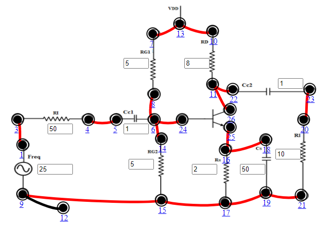

## Procedure

1. Connect the components as mentioned below:
L1-L3, L4-L5, L6-L8, L6-L14, L6-L24, L7-L13, L9-L15, L10-L13, L11-L22, L15-L17, L16-L25, L17-L19, L18-L16, L19-L21, L20-L23, L26-L11, L12-L9.(For eg. click on 1 and then drag to 3 and so on.)
2. Click on 'Check Connection' button to check the connections.
3. If connected wrong, click on the wrong connection. Else click on 'Delete all connection' button to erase all the connections.
4. The Input voltage (Vin) is set to 50mV at 1 KHz frequency.
5. Keeping source voltage constant, vary the frequency from 50 Hz in regular steps.
6. Set Input Resistance (RI)=50Ω.
7. Set Drain Resistance (RD)=8 kΩ, Set Source Resistance (RS)=2 kΩ, Set Load Resistance (RL)=10 kΩ.
8. Set Gate Resistance1 (RG1)=5 MΩ, Set Gate Resistance2 (RG2)=5 MΩ.
9. Set Coupling Capacitor1(CC1)=1 μF, Set Coupling Capacitor2 (CC2) =1 μF, Set Bypass Capacitance (CS)=50μF.
10. Click on "Add to Table" button to add the readings to the table.
11. Vary the Frequency by keeping the resistances constant.
12. Click on "Plot" button to plot the Magnitude graph of the CS Amplifier, Frequency(Hz) along X-axis and Magnitude(dB) along Y-axis.
13. Click on "Clear" button to take another set of readings.

